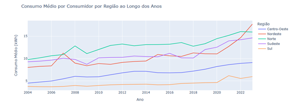
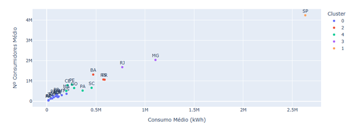

# 🔍 Análise de Consumo de Energia Elétrica no Brasil (2004-2023)

## 👨‍🎓 Aluno
**Jorge Leandro Piva**

---

## 📌 Objetivo
Desenvolver uma análise completa dos dados de consumo de energia elétrica no Brasil, aplicando os conhecimentos adquiridos no Bootcamp de Ciência de Dados.

---

## 🛠️ Etapas do Desenvolvimento

1. **Carregamento das bases de dados**  
   - Consumo por estado
   - Informações dos estados brasileiros

2. **Pré-processamento**  
   - Remoção de valores duplicados
   - Análise e tratamento de valores nulos (descartados após avaliação)

3. **Análises Realizadas**
   - Visão geral de consumo ano a ano
   - Total de consumidores por ano
   - Consumo por região e por estado
   - Consumo médio por consumidor
   - Análise de sazonalidade (consumo por mês)
   - Evolução do consumo residencial
   - Ranking dos estados por consumo e número de consumidores

4. **Visualizações**
   - Gráficos de linha, barras, scatter plots e heatmaps
   - Clusterização com K-means para segmentar estados segundo padrão de consumo

---

## 📊 Principais Insights

- **K-Means Clustering (5 grupos)**
  - **Cluster 0**: Estados com menor consumo/população (ex: ES, MT, DF, AM...)
  - **Cluster 1**: SP isolado (consumo e população extremamente elevados)
  - **Cluster 2**: Estados com alto consumo/população (BA, RS, PR)
  - **Cluster 3**: MG e RJ (intermediários entre SP e o restante do país)
  - **Cluster 4**: Estados medianos (SC, GO, PA, CE, MA...)

- **Destaques de Consumo**
  - Pará e Maranhão com **maior consumo médio** por consumidor, superando SP
  - Região **Nordeste** teve maior crescimento no consumo médio ao longo dos anos
  - Centro-Oeste e Norte se destacaram pelo **crescimento percentual** do consumo

- **Padrões Interessantes**
  - **Alta concentração de consumo nos meses de outubro a dezembro** — possível influência do uso de ar-condicionado
  - Crescimento contínuo do consumo **residencial**, com impacto potencial do home office e maior acesso a eletrônicos

### 🔽 Exemplos de Gráficos

#### Consumo por Região (2023)

#### Clusterização dos Estados

#### Consumo Médio por Estado (Heatmap)

---

## 🧠 Técnicas Aplicadas

- Manipulação e limpeza de dados com **Pandas**
- Visualização com **Matplotlib** e **Seaborn**
- Agrupamento de dados com **K-means clustering**
- Tratamento de dados ausentes
- Análise exploratória profunda (EDA)

---

## 🧩 Melhorias Futuras

- Integração com outras bases como **PIB, IDH, população**
- Análise multivariada mais robusta
- Modelagem preditiva de consumo
- Exploração de variáveis externas para explicar sazonalidade

---

## 📁 Arquivos

- `notebook.ipynb`: Caderno Jupyter com o passo a passo do projeto
- `dados_consumo.csv`: Base de consumo de energia
- `dados_estados.csv`: Informações dos estados
- `README.md`: Documento atual

---

## 🏁 Conclusão

Este projeto sintetiza os principais aprendizados do Bootcamp, aplicando-os em um problema real com análise crítica, visualizações impactantes e geração de insights acionáveis. O uso de clustering trouxe um olhar mais aprofundado sobre padrões regionais de consumo.

> _"A curiosidade levou à descoberta de que o consumo médio de estados como MA e PA ultrapassam SP — algo impensado sem uma análise de dados sólida."_

---
